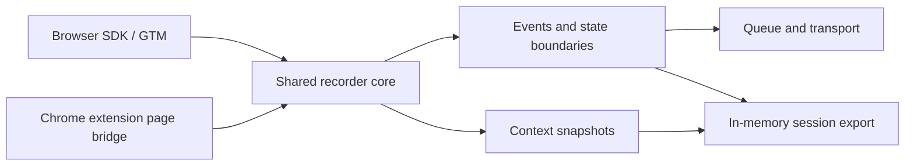

# Flow Recorder

**Capture browser interactions with the context needed to understand a user flow.**

A personal portfolio project exploring browser instrumentation and the foundations of automated test generation. Flow Recorder records interactions, SPA navigation, network activity, and settled UI states through a shared TypeScript engine, exposed as both a browser SDK and a Chrome extension.

**TypeScript · Browser APIs · Chrome Manifest V3 · pnpm workspaces · esbuild · Vitest · Playwright**

[Try it locally](#try-it-locally) · [Architecture](docs/architecture.md) · [Event model](docs/event-schema.md) · [Development](docs/development.md)

> **Status: working prototype for local experimentation.** Use synthetic data: redaction, configuration, and delivery have known gaps. The project records data for future replay; it does not yet generate or execute Selenium tests. See [current limitations](#current-limitations).

## The idea

A click alone says little about a modern web application. The target may live inside a modal, appear after an asynchronous update, or disappear during a route change. Reproducing the interaction requires information about both the action and the state around it.

Flow Recorder explores that problem by pairing browser events with locator candidates, nearby UI context, and state boundaries inferred from DOM and network activity. The demo includes forms, delayed content, modal and drawer interactions, and scrollable lists to exercise those behaviors.

## What the project demonstrates

| Area                    | Implementation                                                                                |
| ----------------------- | --------------------------------------------------------------------------------------------- |
| Browser instrumentation | Capture listeners, History API interception, fetch/XHR metadata, and DOM mutation observation |
| Shared runtime design   | One recording engine used by the browser SDK and the extension's page bridge                  |
| State modeling          | Session, route, and state identifiers, with DOM-quiet and network-idle heuristics             |
| Locator generation      | Ranked test hooks, IDs, labels, semantic hints, CSS, and XPath candidates                     |
| Context capture         | Target metadata, visible UI summaries, and bounded HTML fragments at settled states           |
| Data delivery           | Batched events through HTTP, console, or an extension bridge; in-memory JSON session exports  |

The implementation uses browser APIs directly. This keeps the instrumentation and lifecycle decisions visible in the code.

## How it fits together



The `gtm` mode provides a global browser API for first-party integration experiments. The `extension-local` mode adds an injection and storage layer for local inspection. Both execute the recorder in the page context so it can observe the application's History API and network calls.

[Read the architecture and tradeoffs →](docs/architecture.md)

## Try it locally

You need Node.js and **pnpm 9.12.0**, the package-manager version declared in [package.json](package.json). Run these commands from the repository root:

```bash
pnpm install
pnpm dev:demo
```

Open [localhost:4173](http://127.0.0.1:4173). The development command bundles the demo directly; a full workspace build is not required.

1. Click **Init GTM-like recorder**.
2. Select **Go to forms**, enter synthetic values, and submit the form.
3. Open the modal or drawer and wait for its delayed appearance.
4. Visit **Async list**, load more results, and scroll its container.
5. Click **Export session to console** to inspect the recording in browser DevTools.

You can also inspect the API from the console:

```js
window.FlowRecorder.getStatus();

// Returns the events and snapshots captured so far.
const session = window.FlowRecorder.exportSession();
console.log(session);

window.FlowRecorder.stop();
```

The demo keeps the recorder endpoint blank and uses debug logging. Exporting does not wait for pending UI changes, so allow an interaction to finish before inspecting its settled state.

### Try the Chrome extension

In a separate terminal:

```bash
pnpm dev:extension
```

Open `chrome://extensions`, enable **Developer mode**, and choose **Load unpacked**. Select `apps/extension/dist` inside your checkout. Open the demo tab, leave its SDK recorder stopped, and use the extension popup's **Start recording** button.

See the [extension guide](docs/extension-local-mode.md) for controls and the current export limitation. The [browser SDK / GTM guide](docs/gtm-install.md) covers script-based integration.

## Explore the code

| Path                                                              | Purpose                                                                 |
| ----------------------------------------------------------------- | ----------------------------------------------------------------------- |
| [packages/recorder-core](packages/recorder-core/src/index.ts)     | Recorder lifecycle and capture subsystems                               |
| [packages/selector-engine](packages/selector-engine/src/index.ts) | Locator ranking and target analysis                                     |
| [packages/schema](packages/schema/src/index.ts)                   | Event, snapshot, session, and configuration types                       |
| [packages/transport](packages/transport/src/index.ts)             | Delivery adapters                                                       |
| [packages/sdk-browser](packages/sdk-browser/src/index.ts)         | Browser API and global installation                                     |
| [packages/devtools-shared](packages/devtools-shared/src/index.ts) | Extension bridge contracts                                              |
| [apps/extension](apps/extension)                                  | MV3 service worker, content script, page bridge, and popup              |
| [apps/demo-spa](apps/demo-spa/src/main.ts)                        | Interactive demo built with TypeScript and DOM APIs                     |
| [examples/exported-sessions](examples/exported-sessions)          | Illustrative fixtures for form, modal, navigation, and async-list flows |

Start with `createRecorder` to follow the recording lifecycle, or `generateSelectorCandidates` to explore how locator alternatives are ranked. The fixtures illustrate the data model and possible replay annotations; they are not guaranteed to match the current runtime output exactly.

## Current limitations

- **Privacy and configuration:** input-value redaction exists, but keyboard events, snapshots, and URL metadata have gaps. Some capture switches and subsystem settings are not applied consistently. See [privacy behavior](docs/privacy-redaction.md).
- **Delivery and retention:** HTTP batches omit snapshot bodies, extension downloads can use stale cached data, automatic retry scheduling is incomplete, and in-memory session history is unbounded.
- **Browser coverage:** the extension targets Chrome MV3. Frame and shadow-root path helpers exist, but nested-context capture is incomplete.
- **Build and verification:** the full build currently fails during declaration generation, and the test and lint commands have known failures. See [development status](docs/development.md#verification-status).

There is no hosted demo, ingestion backend, or Selenium generator included in this repository. The local demo and sample exports are the entry points for exploring it.

## Next steps

1. Apply configuration consistently and close redaction gaps across every output path.
2. Restore a passing build and test baseline, then cover recorder lifecycle and extension exports.
3. Add complete snapshot delivery, retry handling, and bounded session retention.
4. Validate locator uniqueness and improve iframe and shadow-root capture.
5. Build a Selenium generator that maps actions to locators and explicit waits.

[Replay roadmap →](docs/selenium-readiness.md)
