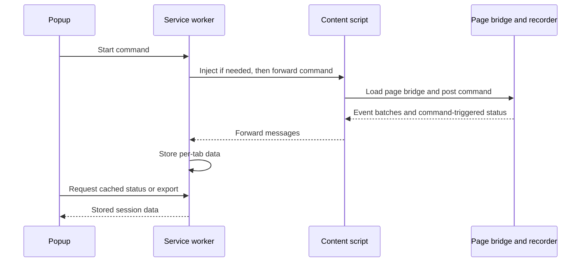

# Architecture

[← Repository overview](../README.md)

Flow Recorder separates recording behavior from installation and delivery. Both runtime modes use [recorder-core](../packages/recorder-core/src/index.ts); the extension adds a bridge around that engine.

## Package boundaries

| Package                                                     | Responsibility                                                                                                     |
| ----------------------------------------------------------- | ------------------------------------------------------------------------------------------------------------------ |
| [schema](../packages/schema/src/index.ts)                   | TypeScript contracts for configuration, events, snapshots, batches, and exports; a partial JSON Schema for batches |
| [selector-engine](../packages/selector-engine/src/index.ts) | Locator candidates, accessible-name heuristics, and target context                                                 |
| [transport](../packages/transport/src/index.ts)             | No-op, console, HTTP, and extension-message delivery                                                               |
| [recorder-core](../packages/recorder-core/src/index.ts)     | Identity, listeners, routes, network tracking, settlement, snapshots, and queues                                   |
| [sdk-browser](../packages/sdk-browser/src/index.ts)         | Global API installation and transport selection                                                                    |
| [devtools-shared](../packages/devtools-shared/src/index.ts) | Message names, bridge types, and extension session contracts                                                       |

The SDK and core depend on these packages through workspace imports. Build scripts bundle source with esbuild and then attempt to emit TypeScript declarations. The declaration setup has [known build failures](development.md#verification-status).

## Runtime paths

### Browser SDK / GTM

1. A page loads the IIFE bundle, which installs `window.FlowRecorder`.
2. `init(config)` creates/configures a recorder and starts it unless `autoStart` is false.
3. The recorder observes the document and patches History, fetch, and XHR APIs.
4. Events enter a queue. In `gtm` mode, a configured endpoint selects HTTP delivery; otherwise debug mode selects console delivery, and the default is a no-op transport.
5. `exportSession()` returns the in-memory session, events, snapshots, and diagnostics.

The repository supplies the client side only. It does not include an ingestion service or deployed SDK host.

### Chrome extension

The page bridge runs the same browser API in `extension-local` mode. It sends batches through `window.postMessage`; the content script forwards them to the service worker for `chrome.storage.local` persistence. Status messages also carry a full session export.

The popup currently exports cached status data without requesting a fresh page export. Incoming batches update the stored event list but not that cached export. See [extension behavior](extension-local-mode.md#export-behavior).

## Recording lifecycle

| Subsystem                            | Role                                                                                                                      |
| ------------------------------------ | ------------------------------------------------------------------------------------------------------------------------- |
| `IdentityManager`                    | Creates visitor, session, tab, pageview, route, and state IDs; rotates sessions after inactivity                          |
| `RouteTracker`                       | Wraps `pushState` and `replaceState`; observes back/forward, hash, visibility, and page lifecycle events                  |
| `NetworkTracker`                     | Wraps fetch and XHR to record method, URL, timing, status, and in-flight counts; does not read request or response bodies |
| `ScrollAggregator`                   | Groups scroll activity into start, progress, and end markers                                                              |
| `StateSettlementManager`             | Promotes a new state after a quiet window or maximum wait                                                                 |
| `DomRefRegistry` and context helpers | Assign temporary DOM references and summarize targets and visible UI                                                      |
| Snapshot manager                     | Collects bounded fragments around the latest interaction target when a state settles                                      |
| `QueueManager`                       | Buffers events, drops older queued events on overflow, and dispatches batches                                             |

`stop()` removes listeners and observers, restores patched APIs, clears subsystem timers, and initiates a queue flush. It keeps the session history available for export. It does not return a promise for delivery completion.

## State boundaries

Routes, action-like events, DOM mutation bursts, and completed requests mark the UI as dirty. The settlement manager emits `state.settling.start`, then checks for:

- DOM quiet: 400 ms without a tracked mutation or dirty trigger.
- Network idle: no tracked requests in flight and 300 ms since network activity.
- Maximum wait: 5,000 ms before settling with a timeout reason.

These are the current defaults. Custom timing values do not reliably reach the already-created settlement manager.

When a state settles, the core rotates `state_id`, optionally creates a snapshot, and emits `state.settled` plus `state.snapshot.created` when applicable. Earlier action events are not backfilled with the new state ID. Quiet-window and timeout outcomes are heuristics, not proof that an application is ready for replay.

## Design choices and tradeoffs

- **One engine, two launch paths.** Keeping capture in the core reduces divergence between SDK and extension recordings. Page-context execution also means patches must coexist with application code.
- **Multiple locator candidates.** Explicit testing hooks rank ahead of structural fallbacks. Confidence reflects heuristics; candidates are not checked for uniqueness.
- **Snapshots at state boundaries.** Fragment capture limits serialized output compared with copying the document on every event. It does not eliminate DOM traversal costs or provide complete privacy filtering.
- **Separate batches and exports.** Batches carry events and session metadata. Full snapshot objects are available only in the in-memory export and status messages, so HTTP collection currently cannot resolve snapshot references on its own.

## Implementation gaps

Configuration is merged after subsystem construction. Identity is initially persisted with default settings; queue, scroll, settlement, and network options can retain their defaults. Click, input, and keyboard capture switches are not enforced by event filtering.

The queue is bounded, but retained events and snapshots are not. Failed sends are requeued without a scheduled retry. Visible-context collection scans and sorts matching elements on each captured user event. Iframe and shadow-root metadata helpers do not provide complete listener coverage inside those contexts.

See [privacy and redaction](privacy-redaction.md), [development status](development.md), and the [replay roadmap](selenium-readiness.md) for the remaining work.
